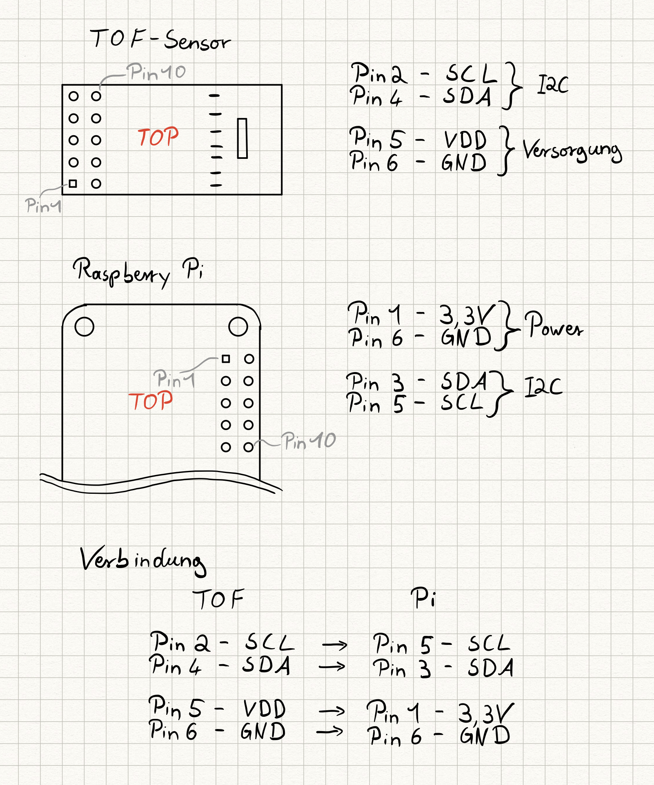

# Raspberry Pi TOF and OCD Setup Stuff

## Usage
* Simply connecting the raspberry pi to a power source will start it, connect to wifi, and start the program.
* Several settings can be adjusted via OSC messages:
    * LEDs: Led colour can be adjusted via hsv values (between 0 and 1)
    `/columnX/leds [h] [s] [v]`
    * The cutoff (distance after which no values are returned) can be set in milimeters:
    `/columnX/cutoff [valueInMilimeters]`
    * Max/min brightness of the LEDs can be set as a value between 0 and 1:
    `/columnX/min_brightness [value]`
    `/columnX/max_brightness [value]`

## Software setup raspberry pi
* Flash the SD card with full [Raspian](https://www.raspberrypi.org/downloads/raspbian/) the desktop can be disabled later or directly after initial setup, since the CLI is all we really need.
* Configure WiFi and set up a static IP-Adress to make it easier to connect to the pi via SSH and/or VNC to transfer Files and change settings without the need of a Monitor and Keyboard, Mouse.
* Activate VNC, SSH and I2C in the settings menu
* Install Python Modules for TOF Sensor and OCD via the cli/terminal
* [TOF Module](https://github.com/pimoroni/vl53l1x-python)
``sudo pip3 install smbus2``
``sudo pip3 install vl53l1x``
* [OCD Module](https://github.com/attwad/python-osc)
``sudo pip3 install python-osc``
* [LED Module](https://github.com/adafruit/Adafruit_CircuitPython_NeoPixel)
``sudo pip3 install rpi_ws281x adafruit-circuitpython-neopixel``

* Copy `send_tof_osc_single.py` to a location on the pi (currently Desktop).
* Make sure `PI_IP`, `SERVER_PORT`, and `COLUMN` are set to the correct values. 
* Make file executable 
`chmod u+x [filename]`
* Create system service. 
`sudo systemctl edit --full --force send_tof_osc.service`
* Enter the following:
    ```
    [Unit]
    Description=OSC Service
    After=multi-user.target

    [Service]
    Type=idle
    ExecStart=sudo /home/pi/Desktop/send_tof_osc_single.py

    [Install]
    WantedBy=multi-user.target
    ```
* Activate the systemservice
`sudo systemctl activate send_tof_osc.service`
* The program should now start on a reboot or can be manually started via `sudo systemctl start send_tof_osc.service`


## Conections
* Connect TOF Sensor power and I2C to Raspberry Pi
